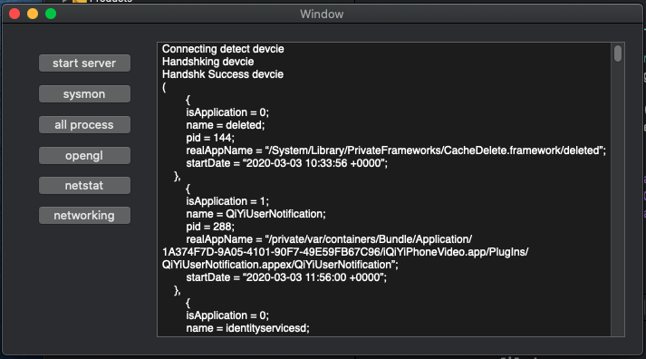
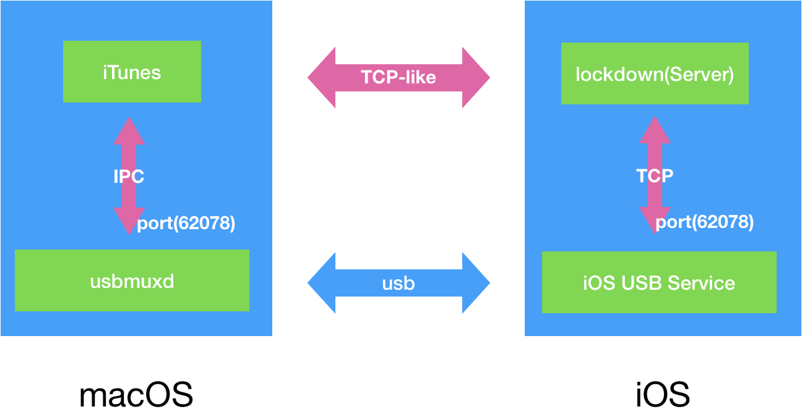
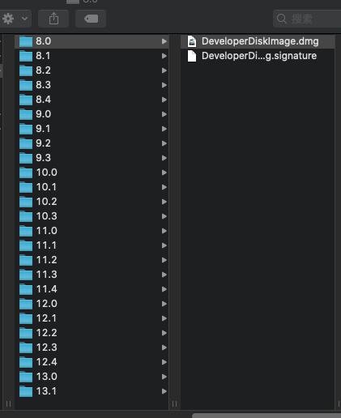
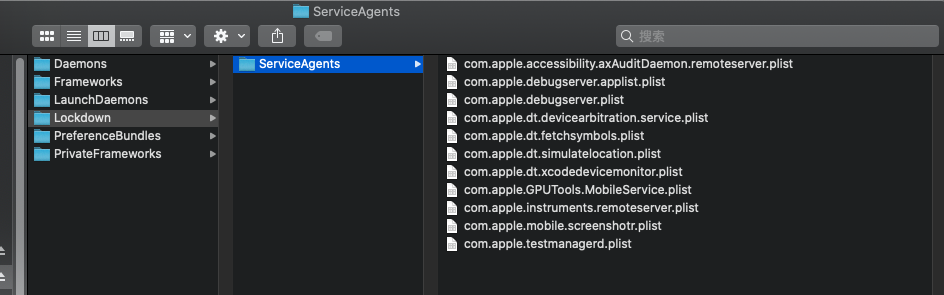
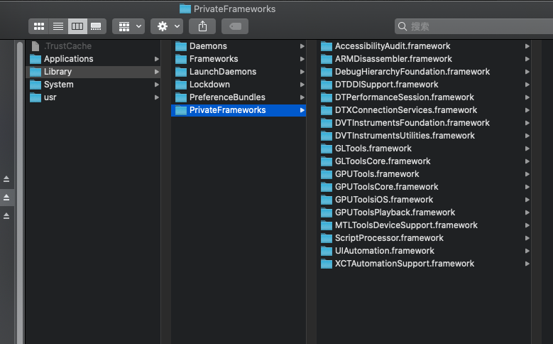
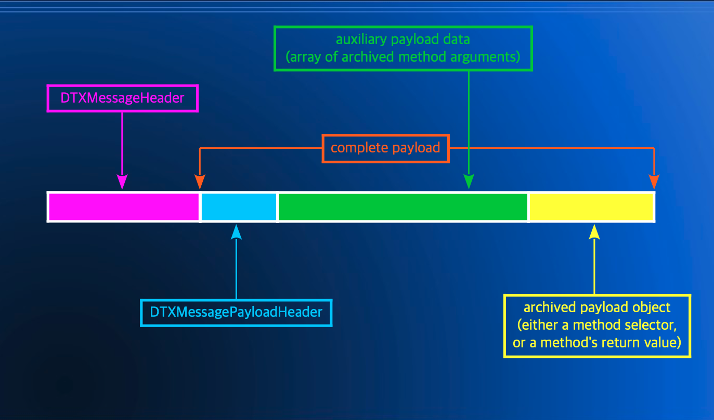
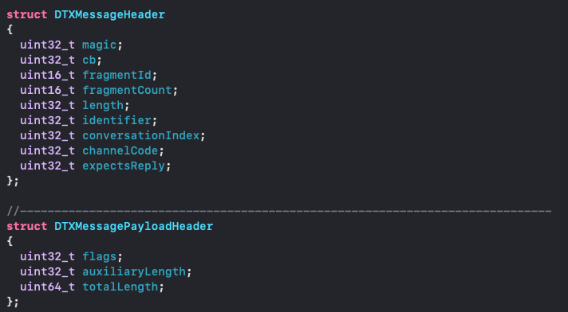
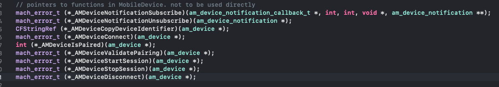
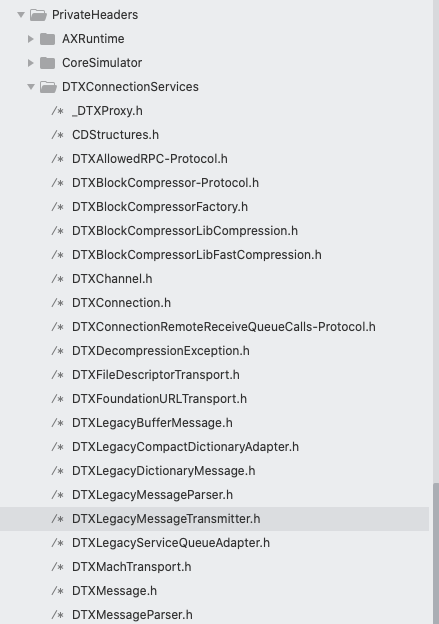
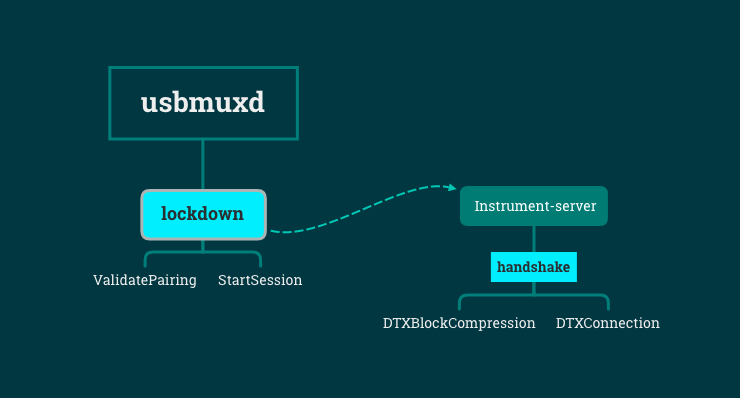

# PerfDog 的iOS实现原理 (Part 1)

>姓名：Jimmy-Leung
>联系方式：E-mail:ljm5000@163.com 

## 目的：

#### 现在市面上能做到 <big> 跨平台</big> 监控数据的  <big>只有腾讯  一家PerfDog</big>，确实有技术含量。但是腾讯对于PerfDog的技术比较保密， 出于人无我有，人有我优的基本理念，为了能让更多人知道和了解iOS的性能获取原理，本文简要的描述我们的实现过程

## 我们的进度：

#### 基本已经实现所有PerfDog的功能(包括跨平台) ✌️✌️✌️✌️

## 项目总结：
iOS Instrument-Server 就像一个按钮，你掌握了打开这个按钮的方式，iOS Device就会给你发送数据。

## 看了本文能得到些什么：
* 了解市面上常用开源工具，及demo运行
* 基于Mac的基本数据获取demo运行
* 大概能了解Perfdog的基本原理，动手能力强的小伙伴也能顺着我们的思路来实现一套

## Showoff一下：


👉[Mac数据获取demo](https://github.com/ljm5000/JMInstrument.git)

## 本文展示内容：

1. 用到的开源工具原理
2. iOS/Mac OS系统的部分原理
3. 实现过程的描述

### 本次实践只会展示基于Mac os下的iOS性能获取

## 本次文章将分为4个部分：
 
* iOS Instrument-server的工作原理 (Part 1)
* iOS Instrument-server的实现过程 (Part 2)
* 如何跨平台实现iOS Instrument-server (Part 3)
* 在实验过程中遇到的问题 (Part 4)
  

# iOS Instrument-server的工作原理

##本章目录

* Mac os/iOS的协议，工具，系统原理
	* LaunchDaemon
	* LOCKDOWN
	* USBMUX
	* NSKeyarchieved and NSUnarchiver
	* Framework
		* DeveloperDiskImage.dmg
	   * Xcode Plugin
	* 关键私有类DTXMessage

* 市面上能与iOS 设备联通的工具以及能力介绍：
	* usbmux
	* libimobiledevice
	* idb
	* bpylist
	
* iOS Instrument-server的联通机制：
   * 握手
   * 联通
   * 回包解析

## Mac os/iOS的协议，工具，系统原理
* LaunchDaemon
* LOCKDOWN
* USBMUXD
* NSKeyarchieved and NSUnarchiver
* Framework
	* DeveloperDiskImage.dmg
	* MobileDevice.framework

#### LaunchDaemon

LaunchDaemon 简称 Launchd, 维基百科的描述是：

> In computing, launchd, a unified operating system service management framework, starts, stops and manages daemons, applications, processes, and scripts in macOS.

👉[看这个大哥的文章](https://blog.yorkxin.org/2011/08/04/osx-launch-daemon-agent)

>> Mac OS X 從 10.4 開始，採用 launchd 來管理整個作業系統的 services 及 processes 。傳統的 UNIX 會使用 /etc/rc.* 或其他的機制來管理開機時要啟動的 startup services ，而現在的 Mac OS X 使用 launchd 來管理，它的 startup service 叫做 Launch Daemon 和 Launch Agents 。而視為 service 的程式，就該是 background process ，不應該提供 GUI ，也不應該跳到 （console 的）foreground 。當然有些例外，例如聽快速鍵之後跳出視窗的程式。

说白了LaunchDaemon其实就相当于windows上的任务管理系统，而他的启动方式是有一个注册表(plist)来启动服务

#### Lockdown

> lockdownd 就行用户态的狱警，是所有越狱者的头号敌人。lockdownd 由 launch 启动，负责设备激活、备份、崩溃报告、设备同步以及其他服务。lockdownd 注册 com.apple.lockdown.host_watcher Mach 服务，监听 TCP 端口 62078 以及 UNIX domain 套接字 /var/run/lockdown.sock。还有一个小程序/usr/libexec/lockbot 辅助lockdownd。lockdownd 实际上是一个迷你launchd. lockdownd 在 /System/Library/Lockdown/Services.plist 文件中维护了一个自己要启动的服务列表。这个列表中有一个重要的服务：afc，这个服务负责在 iTunes 主机和 i- 设备之间传递文件。lockdown 和 launchd一样 以root 用户权限预先，在运行其他进程之前，如果指定了UserName 键，则会降低进程的权限。

>作者：CoderKo1o
链接：https://www.jianshu.com/p/5f5c8eb9bac8
来源：简书
著作权归作者所有。商业转载请联系作者获得授权，非商业转载请注明出处。


#### USBMUXD
usbmuxd是对usbmux协议在macOS平台的上实现，也是macOS系统上的一个守护进程（Daemon），它随着系统的启动而启动。



说白了，usbmuxd的作用就是，通过usb来构建一条socket通道来实现Mac OS与iOS之间的通讯

##干货时刻(监听数据)：

通过下面的命令行，基本上能获取所有经过该USBMUXD的数据

```
### 转移usbmuxd
sudo  mv /var/run/usbmuxd /var/run/usbmuxx
### 监听usbmuxd
sudo socat -t100 -x  \
UNIX-LISTEN:/var/run/usbmuxd,mode=777,reuseaddr,\
fork UNIX-CONNECT:/var/run/usbmuxx 
### 恢复位置 (如果不做这一步，你的电脑需要重启才能监听到设备)
sudo  mv /var/run/usbmuxd /var/run/usbmuxx 
```

👉 [usbmuxd-protocol](https://zyqhi.github.io/2019/08/20/usbmuxd-protocol.html)

#### NSKeyarchieved and NSUnarchiver
👉[先对你抛来一波官方描述](https://developer.apple.com/documentation/foundation/nskeyedarchiver)
>
>NSKeyedArchiver, a concrete subclass of NSCoder, provides a way to encode objects (and scalar values) into an architecture-independent suitable for storage in a file. When you archive a set of objects, the archiver writes the class information and instance variables for each object to the archive. The companion class NSKeyedUnarchiver decodes the data in an archive and creates a set of objects equivalent to the original set.
A keyed archive differs from a non-keyed archive in that all the objects and values encoded into the archive have names, or keys. When decoding a non-keyed archive, the decoder must decode values in the same order the original encoder used. When decoding a keyed archive, the decoder requests values by name, meaning it can decode values out of sequence or not at all. Keyed archives, therefore, provide better support for forward and backward compatibility.
The keys given to encoded values must be unique only within the scope of the currently-encoding object. A keyed archive is hierarchical, so the keys used by object A to encode its instance variables don’t conflict with the keys used by object B. This is true even if A and B are instances of the same class. Within a single object, however, the keys used by a subclass can conflict with keys used in its superclasses.
An NSArchiver object can write the archive data to a file or to a mutable-data object (an instance of NSMutableData) that you provide.

假设大家已经看懂了，我大致说下它的作用就是，对象序列化和反序列化的工具，而这个工具是十分牛逼的，会比json,xml解析速度要快，而且传输体积会很小。做iOS/Mac OS开发的同学对他可能不会太陌生，这个原理后续解析和描述也会用到。

👉[向你丢来一波简单使用](https://www.jianshu.com/p/9206246ac06c)

#### DeveloperDiskImage.dmg
对于这个包，可能部分开发的同学不陌生，但是大多数的都是陌生的。如果你安装了Xcode那么它的位置在：
> /Applications/Xcode.app/Contents/Developer/Platforms/iPhoneOS.platform/DeviceSupport/8.0/DeveloperDiskImage.dmg 



从图片基本可以联想到，这个库和iOS的系统有关， 你的机器能支持的系统 = 这里含有的DeveloperDiskImage的版本。

#### 包含了啥？

* Lockdown/ServiceAgnets



* 从上面对Laucnd和lockdown的描述大概可以知道，iOS设备的是通过挂载这些plist注册表从而使得iOS设备获得调试能力的

PrivateFramework



往后将会对于这里面的几个库文件进行逆向来获取他们的工作流程


### 上述的所有原理适用于iOS，通过对越狱机器ssh可以发现，iOS的目录结构其实和Mac OS上十分相似.

### 关键私有类DTXMessage
[全靠 ida 大佬的解析](https://recon.cx/2018/montreal/schedule/system/event_attachments/attachments/000/000/043/original/RECON-MTL-2018-Discovering_the_iOS_Instruments_Server.pdf)



头文件的解析



有了这个头文件，就可以知道如何通过usbmuxd返回来的数据给处理掉.

####这里不作深入了，一下章详细描述如何反序列化二进制数据

-----

### 市面上能与iOS 设备联通的工具以及能力介绍

1. libimobiledevice / usbmuxd [libimobiledevice](https://github.com/libimobiledevice/libimobiledevice.git)
2. idb [Facebook](https://github.com/facebook/idb.git)
3. bpylist

#### libimobiledevice /usbmuxd
先说说这个 libimobiledevice
这个库是个十分🐂比的库，基本上市面上所有的 xx助手都是基于他来做，围绕着这个库能做的东西如下：

1. 加载dmg
2. get device info
3. 安装/卸载 app
4. screenshot
5. idevice-entry-recovery
6. idevicedebug
7. idevicedianostics
8. idevicesyslog
9. 同步
10. 等等等

[usbmuxd](https://github.com/libimobiledevice/usbmuxd)

> A socket daemon to multiplex connections from and to iOS devices.

换句话说，这个库已经帮我们实现了跨平台的通讯，不过对于我们此次的demo来说，我们用的是加载<big>Mac os</big>上的私有库。

#### MobileDevice.framework

>/System/Library/PrivateFrameworks/MobileDevice.framework/MobileDevice

使用苹果的私有库的好处是：

1. usbmuxd会在个别机器上面有bug, 在开发过程中有时候测试设备有限，这些坑会比较难跨越
2. 联通以后的配对问题，要对ssl证书校验，用苹果私有Api已经可以解决掉这个问题
3. 把MobileDevice拆开你基本上也可以照着来调用他的方法。

将会用到的几个函数


#### idb

官方描述
>The “iOS Development Bridge” or idb, is a command line interface for automating iOS Simulators and Devices for development. It has three main goals:

>Remote Automation: idb is composed of a "companion" that runs on macOS and a python client that can run anywhere. This enables scenarios such as a "Device Lab" within a Data Center or fanning out shards of test executions to a large pool of iOS Simulators.
Simple Primitives: idb exposes granular commands so that sophisticated workflows can be sequenced on top of them. This means you can use idb from an IDE or build an automated testing scenario that isn't feasible with default tooling. All of these primitives aim to be consistent across iOS versions and between iOS Simulators and iOS Devices. All the primitives are exposed over a cli, so that it easy to use for both humans and automation.
Exposing missing functionality: Xcode has a number of features that aren't available outside it's user interface. idb leverages many of Private Frameworks that are used by Xcode, so that these features can be in GUI-less automated scenarios.

说白了，就是使用了Mac os的私有库来实现一些自动化功能和简单的命令行工作。
下载idb的源码，能看到



仔细观察可以发现，facebook dump了一些私有库的头文件。这个后面将会用到，私有库的头文件十分重要，获取了二进制数据以后，是依靠这些头文件进行二进制数据解析的

-------

### iOS Instrument-server的联通机制：



-------
##下一章主要描述，获取数据与解析数据